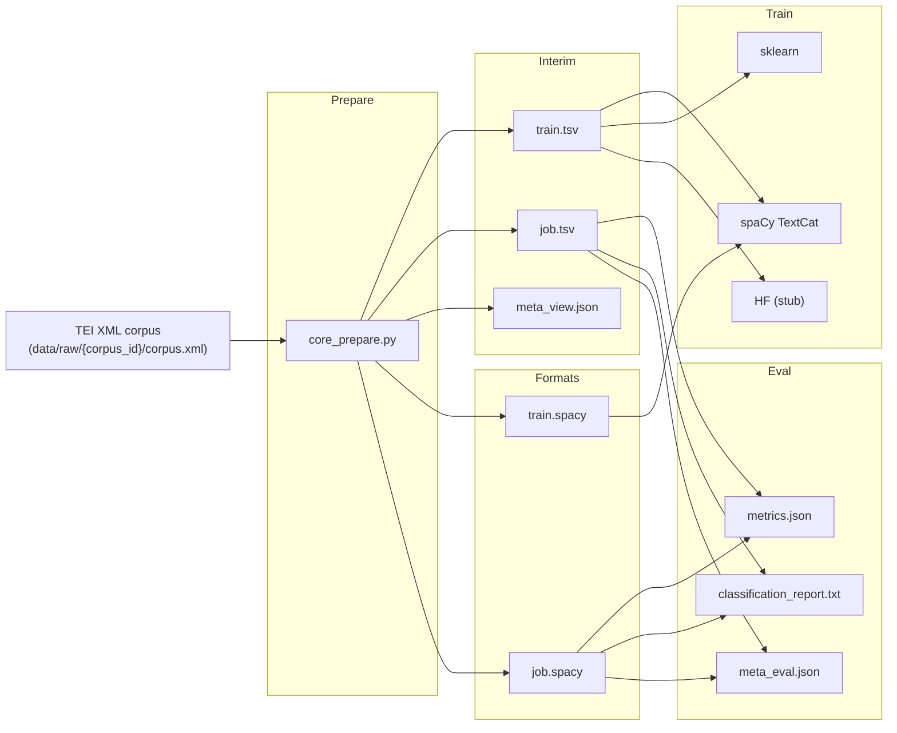
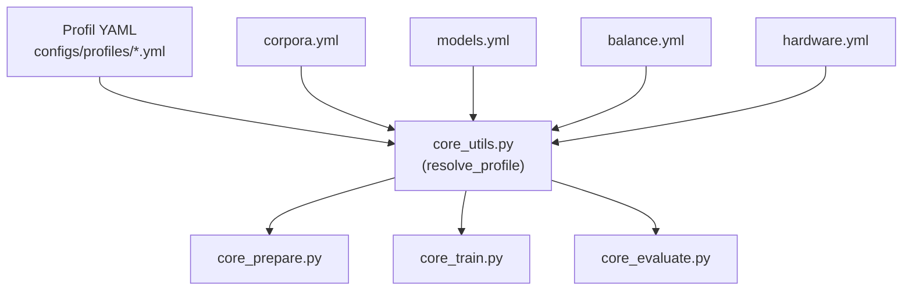

# PEPM_V4 – Pipeline de classification de textes (config-first)

> **Version du pipeline : `4.0.0-dev`**
> V4 est une refonte du pipeline PEPM (successeur de V2 / V3) orientée :
> - **multimodèle** (spaCy, sklearn, HF – stub),
> - **multicorpus** (web1, web2, …),
> - **multimodale** (web, futur ASR/gold, etc.),
> avec un cœur **config-first** : on change les expériences en YAML, pas dans le code.

---

## 1. Ce que fait V4 (en une minute)

V4 sert à :

1. Lire un corpus **TEI XML** (`data/raw/{corpus_id}/corpus.xml`),
2. Construire une **vue supervisée** équilibrée :
   - `data/interim/{corpus_id}/{view}/train.tsv`
   - `data/interim/{corpus_id}/{view}/job.tsv`
   - `meta_view.json`
3. Préparer les formats pour chaque famille de modèles :
   - spaCy : `train.spacy`, `job.spacy` (DocBin)
   - autres familles : restent sur TSV
4. Entraîner des modèles :
   - **spaCy TextCat**,
   - **sklearn** (SVM, Perceptron, arbres, forêts, …),
   - **HF (Transformers)** : interface prête, entraînement/éval encore en **stub**.
5. Évaluer les modèles :
   - `metrics.json`,
   - `classification_report.txt`,
   - `meta_model.json`, `meta_eval.json` pour la reproductibilité.

Tout est piloté par :

- des **profils** (`configs/profiles/*.yml`) qui décrivent une expérience,
- des configs communes (`configs/common/*.yml`) pour les corpus, modèles, hardware, équilibrage.

### 1.1 Vue d’ensemble du pipeline (Mermaid)



---

## 2. Organisation du dépôt

Arborescence logique :

```text
PEPM_V4/
  dev_V4.md                     # doc de dev (architecture, objectifs)
  README.md                     # (ce fichier)
  configs/
    common/
      corpora.yml               # corpus TEI déclarés (web1, web2, ...)
      balance.yml               # stratégies d'équilibrage des classes
      hardware.yml              # presets matériel (small, medium, lab)
      models.yml                # registre complet des modèles (spaCy / sklearn / HF)
    label_maps/
      ideology_global.yml       # mapping des labels bruts -> labels consolidés
    profiles/
      ideo_quick.yml            # profil rapide idéologie globale
      ideo_full.yml             # profil complet idéologie globale
      crawl_quick.yml           # profil rapide vue "crawl"
      crawl_full.yml            # profil complet vue "crawl"
      check_only.yml            # profil "sanity check" (stats)
      custom.yml                # profil neutre à surcharger via OVERRIDES
  scripts/
    core/
      core_prepare.py           # TEI -> TSV + formats (spaCy DocBin)
      core_train.py             # entraînement des modèles
      core_evaluate.py          # évaluation des modèles
      core_utils.py             # résolution des profils, configs, meta, etc.
    pre/
      pre_check_config.py       # validation d'un profil avant run
      make_ideology_skeleton.py # génération squelette de label_map
    post/
      __init__.py               # (futurs post-traitements/agrégations)
    experiments/
      __init__.py               # (futurs scripts de sweeps/grid)
  data/
    raw/{corpus_id}/corpus.xml              # (à fournir)
    interim/{corpus_id}/{view}/...          # TSV + meta générés
    processed/{corpus_id}/{view}/...        # DocBin spaCy + meta formats
  models/{corpus_id}/{view}/{family}/{model_id}/...   # modèles + meta_model.json
  reports/{corpus_id}/{view}/{family}/{model_id}/...  # métriques + meta_eval.json
```

> La structure `data/`, `models/`, `reports/` est créée automatiquement par les scripts core.

### 2.1 Résolution config → scripts (Mermaid)



---

## 3. Installation

### 3.1 Prérequis

* **Python** ≥ 3.9 (recommandé : 3.10+)
* OS : Linux / macOS (Windows OK via commandes Python directes)
* RAM : dépend du corpus ; pour un laptop 8 Go, utiliser le preset `hardware: small`.

### 3.2 Environnement virtuel (recommandé)

```bash
cd PEPM_V4

python -m venv .venv
source .venv/bin/activate      # Windows : .venv\Scripts\activate
```

### 3.3 Dépendances Python (exemple minimal)

Adaptable à ton setup, mais en gros :

```bash
pip install -U pip

pip install \
  spacy \
  scikit-learn \
  pyyaml \
  joblib \
  tqdm \
  transformers \
  datasets \
  torch   # si tu veux utiliser HF (CPU)
```

> V4 utilise **spaCy en “blank(lang)”** pour TextCat, donc pas besoin de télécharger un modèle pré-entraîné, sauf si tu veux en ajouter un pour d’autres tâches.

---

## 4. Préparer les données

### 4.1 Déclarer un corpus TEI

Dans `configs/common/corpora.yml`, chaque corpus est déclaré ainsi :

```yaml
web1:
  corpus_id: "web1"
  corpus_path: "data/raw/web1/corpus.xml"
  encoding: "utf-8"
  default_modality: "web"
  notes: "Corpus web initial (ex V2)"
```

Créer le dossier et déposer ton TEI :

```bash
mkdir -p data/raw/web1
cp /chemin/vers/ton/corpus.xml data/raw/web1/corpus.xml
```

### 4.2 Créer/annoter un label map (optionnel mais recommandé)

1. **Générer un squelette d’idéologie** pour annotation manuelle :

   ```bash
   python scripts/pre/make_ideology_skeleton.py \
     --corpus data/raw/web1/corpus.xml \
     --out-yaml configs/label_maps/ideology_actors.yml \
     --out-report data/configs/actors_counts_web1.tsv \
     --min-chars 200 \
     --top-variants 5
   ```

2. **Annoter à la main** `ideology_actors.yml` ou autre fichier.

3. Utiliser ce fichier comme `label_map` dans tes profils (ou fusionner dans un `ideology_global.yml`).

---

## 5. Lancer une expérience standard

### 5.1 Exemple : profil `ideo_quick` (idéologie globale, rapide)

Le profil `configs/profiles/ideo_quick.yml` ressemble à :

```yaml
profile: "ideo_quick"
description: "Classification idéologie globale, pipeline rapide (V4)"

corpus_id: "web1"
view: "ideology_global"
modality: "web"

label_field: "ideology"
label_map: "configs/label_maps/ideology_global.yml"

train_prop: 0.8
min_chars: 280
max_tokens: 512

balance_strategy: "alpha_total"
balance_preset: "default_alpha_total"

families:
  - "check"
  - "spacy"
  - "sklearn"

models_spacy:
  - "spacy_cnn_quick"

models_sklearn:
  - "tfidf_svm_quick"

models_hf: []

hardware_preset: "small"
debug_mode: false
```

#### 5.1.1 Pré-check du profil (fortement conseillé)

```bash
python scripts/pre/pre_check_config.py \
  --profile ideo_quick \
  --verbose
```

Ce script vérifie notamment :

* que `corpus_id` existe dans `corpora.yml`,
* que les modèles listés existent dans `models.yml`,
* que `label_map` est lisible,
* que le preset `hardware_preset` existe.

#### 5.1.2 Étape 1 – Préparation (TEI → TSV + formats)

```bash
python scripts/core/core_prepare.py \
  --profile ideo_quick \
  --verbose
```

Effet :

* lit `data/raw/web1/corpus.xml` en **streaming** (iterparse),
* applique les filtres :

  * longueur minimale (`min_chars`),
  * `max_tokens` (compte naïf de mots via `text.split()`),
  * modalité (`modality: "web"`),
  * mapping de labels via `label_map`,
* applique la stratégie d’**équilibrage** (ici `alpha_total`),
* splitte en train/job (`train_prop: 0.8` + seed),
* écrit :

```text
data/interim/web1/ideology_global/train.tsv
data/interim/web1/ideology_global/job.tsv
data/interim/web1/ideology_global/meta_view.json

data/processed/web1/ideology_global/spacy/train.spacy
data/processed/web1/ideology_global/spacy/job.spacy
data/processed/web1/ideology_global/spacy/meta_spacy_formats.json

data/processed/web1/ideology_global/meta_formats.json
```

#### 5.1.3 Étape 2 – Entraînement

```bash
python scripts/core/core_train.py \
  --profile ideo_quick \
  --verbose
```

Pour chaque famille listée dans `families` :

* **check** :

  * lit `train.tsv`,
  * calcule des stats de base (répartition des labels, etc.),
  * produit un `meta_model.json` de “pseudo-modèle”.
* **spaCy** :

  * lit `train.spacy` (ou fallback TSV),
  * crée un `nlp = spacy.blank(lang)` + TextCat,
  * entraîne pendant `epochs` définis dans `models.yml`,
  * sauvegarde dans `models/web1/ideology_global/spacy/spacy_cnn_quick/`.
* **sklearn** :

  * lit `train.tsv`,
  * instancie le `vectorizer` et l’`estimator` définis dans `models.yml`,
  * ajuste `n_jobs` selon `hardware.max_procs`,
  * sauvegarde `model.joblib` dans `models/web1/ideology_global/sklearn/tfidf_svm_quick/`.

Chaque modèle a un `meta_model.json` qui enregistre :

* corpus, vue, famille, `model_id`,
* paramètres importants,
* nombre de docs, classes, etc.

#### 5.1.4 Étape 3 – Évaluation

```bash
python scripts/core/core_evaluate.py \
  --profile ideo_quick \
  --verbose
```

Pour chaque modèle :

* lit `job.tsv` (ou fallback `train.tsv`),
* prédit les labels,
* calcule :

  * accuracy,
  * macro-F1,
  * classification_report sklearn,
* écrit :

```text
reports/web1/ideology_global/{family}/{model_id}/metrics.json
reports/web1/ideology_global/{family}/{model_id}/classification_report.txt
reports/web1/ideology_global/{family}/{model_id}/meta_eval.json
```

---

## 6. Orchestration via Makefile (optionnel)

Si tu ajoutes un **Makefile V4** (décrit dans `dev_V4.md`), les commandes typiques sont :

```bash
# Lister les profils
make list_profiles

# Vérifier un profil
make check_profile PROFILE=ideo_quick

# Pipeline complet : prepare + train + evaluate
make pipeline PROFILE=ideo_quick

# Limiter à une famille
make train PROFILE=ideo_quick FAMILY=sklearn
make evaluate PROFILE=ideo_quick FAMILY=spacy

# Préparation “à blanc” (pas d’écriture de fichiers)
make prepare_dry PROFILE=ideo_quick
```

Sur Windows ou sans `make`, il suffit de reprendre les commandes Python présentes dans le Makefile.

---

## 7. Profils, modèles, équilibrage : où configurer quoi ?

### 7.1 Profils (`configs/profiles/*.yml`)

Un **profil** décrit une expérience logique :

* `corpus_id`, `view`, `modality`,
* `label_field` + `label_map`,
* `train_prop`, `min_chars`, `max_tokens`,
* stratégie d’**équilibrage** (`balance_strategy` + `balance_preset`),
* familles de modèles (`families`),
* liste des modèles par famille (`models_spacy`, `models_sklearn`, `models_hf`),
* preset matériel (`hardware_preset`),
* drapeau `debug_mode`,
* éventuellement `seed` (si exposé ou résolu via `core_utils`).

Tu peux dériver un profil existant, ou utiliser `custom.yml` + `OVERRIDES` :

```bash
python scripts/core/core_prepare.py \
  --profile custom \
  --override corpus_id=web2 \
  --override view=ideology_global \
  --override hardware_preset=lab \
  --verbose
```

### 7.2 Modèles (`configs/common/models.yml`)

Registre des modèles, par famille :

* **spaCy** : `spacy_cnn_quick`, `spacy_cnn_full`, `spacy_cnn_debug`, …
* **sklearn** : `tfidf_svm_quick`, `tfidf_smo_linear`, `tfidf_smo_rbf`,
  `tfidf_perceptron`, `tfidf_randomtree`, `tfidf_randomforest`, …
* **HF** : `camembert_base`, `flaubert_base_cased`, `bert_mbert_base`, …

> Ajouter un modèle = **ajouter un bloc YAML** ici.
> Pas besoin de modifier les scripts core pour un nouveau modèle au sein d’une famille existante.

### 7.3 Équilibrage (`configs/common/balance.yml`)

Stratégies supportées :

* `none` : pas d’équilibrage,
* `alpha_total` : répartition autour d’un `total_docs` cible, interpolant entre uniforme / distribution naturelle (implémentation V4-v1 simplifiée),
* `cap_docs` : limite du nombre de documents par label,
* `cap_tokens` : **placeholder** (structure définie, logique d’équilibrage à implémenter).

Un profil choisit :

```yaml
balance_strategy: "alpha_total"
balance_preset: "default_alpha_total"
```

Les paramètres fins (`total_docs`, `alpha_uniform`, etc.) se trouvent dans `balance.yml`.

### 7.4 Hardware (`configs/common/hardware.yml`)

Presets machine :

* `small` (laptop),
* `medium`,
* `lab` (serveur).

Chaque preset définit :

* `ram_gb` (indicatif),
* `max_procs` (limite `n_jobs`),
* `blas_threads` (OMP/MKL/OPENBLAS),
* tailles de chunk pour TSV / DocBin.

Les scripts core posent automatiquement :

```text
OMP_NUM_THREADS
MKL_NUM_THREADS
OPENBLAS_NUM_THREADS
```

en fonction de `hardware.blas_threads`.

### 7.5 Résumé des paramètres de profil (tableau)

| Paramètre YAML     | Niveau        | Type      | Exemple                                  | Rôle principal                                                  |
| ------------------ | ------------- | --------- | ---------------------------------------- | --------------------------------------------------------------- |
| `profile`          | profil        | string id | `"ideo_quick"`                           | Nom logique du profil (clé pour `--profile`).                   |
| `description`      | profil        | string    | `"Classification idéologie..."`          | Description courte de l’expérience.                             |
| `corpus_id`        | profil        | string id | `"web1"`                                 | Pointe vers une entrée de `corpora.yml`.                        |
| `view`             | profil        | string id | `"ideology_global"`                      | Vue supervisée (type de tâche / label).                         |
| `modality`         | profil        | string id | `"web"`                                  | Modalité filtrée dans le TEI (web, asr, gold, …).               |
| `label_field`      | profil        | string    | `"ideology"`                             | Nom du champ de label cible dans la vue.                        |
| `label_map`        | profil        | chemin    | `configs/label_maps/ideology_global.yml` | Mapping labels bruts → labels consolidés.                       |
| `train_prop`       | profil        | float     | `0.8`                                    | Proportion de docs dans le split train vs job.                  |
| `min_chars`        | profil        | int       | `280`                                    | Longueur minimale de texte (en caractères).                     |
| `max_tokens`       | profil        | int       | `512`                                    | Nombre max. de tokens naïfs (`text.split`) avant exclusion.     |
| `balance_strategy` | profil        | string id | `"alpha_total"`                          | Choix global d’équilibrage (`none`, `alpha_total`, `cap_docs`). |
| `balance_preset`   | profil        | string id | `"default_alpha_total"`                  | Preset de paramètres dans `balance.yml`.                        |
| `families`         | profil        | liste     | `["check","spacy","sklearn"]`            | Familles de modèles à activer pour ce run.                      |
| `models_spacy`     | profil        | liste     | `["spacy_cnn_quick"]`                    | Modèles spaCy à entraîner.                                      |
| `models_sklearn`   | profil        | liste     | `["tfidf_svm_quick"]`                    | Modèles sklearn à entraîner.                                    |
| `models_hf`        | profil        | liste     | `[]`                                     | Modèles HF à entraîner (stub V4).                               |
| `hardware_preset`  | profil        | string id | `"small"`                                | Preset de ressources dans `hardware.yml`.                       |
| `debug_mode`       | profil        | bool      | `false`                                  | Si `true` : sous-échantillonnage pour debug rapide.             |
| `seed` (si exposé) | profil/commun | int       | `42`                                     | Seed pour le split et certains modèles (reproductibilité).      |

### 7.6 Combinaisons recommandées (tableau)

| Scénario                      | Profil(s)                            | Familles                  | Modèles principaux                              | Hardware | Usage typique                                   |
| ----------------------------- | ------------------------------------ | ------------------------- | ----------------------------------------------- | -------- | ----------------------------------------------- |
| **Baseline rapide idéologie** | `ideo_quick`                         | `check, spacy, sklearn`   | `spacy_cnn_quick`, `tfidf_svm_quick`            | `small`  | Sanity check quotidien, résultat rapide.        |
| **Run complet idéologie**     | `ideo_full`                          | `check, spacy, sklearn`   | `spacy_cnn_full`, `tfidf_svm_quick` + variantes | `medium` | Run de référence pour comparaisons V2/V4.       |
| **Vue “crawl” rapide**        | `crawl_quick`                        | `check, sklearn`          | `tfidf_svm_quick`, `tfidf_perceptron`           | `small`  | Tests sur vue crawl / métadonnées.              |
| **Sanity check uniquement**   | `check_only`                         | `check`                   | (pseudo-modèle)                                 | `small`  | Vérifier corpus/labels sans entraînement.       |
| **Nouveau corpus (web2)**     | `custom` + override                  | `check, spacy, sklearn`   | à préciser (`models.yml`)                       | dépend   | Adapter pipeline à un nouveau corpus TEI.       |
| **Debug agressif**            | profil au choix + `debug_mode: true` | `check` + 1 modèle simple | `spacy_cnn_debug` ou `tfidf_svm_quick`          | `small`  | Débogage core_prepare / core_train / core_eval. |

---

## 8. Limitations connues & roadmap

* **HF (Transformers)** :

  * les entrées HF sont déclarées dans `models.yml`,
  * les fonctions `train_hf_model` / `eval_hf_model` sont pour l’instant des **stubs** (message “non implémenté”).
* **`max_tokens`** :

  * enforcement naïf : `len(text.split()) > max_tokens` → doc ignoré,
  * possibilité future de brancher un vrai tokenizer (spaCy, HF) au même endroit.
* **`cap_tokens`** :

  * paramétrage YAML déjà en place, logique d’équilibrage à implémenter.
* **Très gros corpus** :

  * le TEI est lu en streaming, mais les documents retenus sont stockés en mémoire pour l’équilibrage et le split,
  * à surveiller sur des dizaines de millions de docs (pré-filtrer ou utiliser un profil “quick”).

---

## 9. Documentation complémentaire

Pour les détails fins (architecture, héritage V1/V2, check-list de non-régression, etc.) :

* **`dev_V4.md`**
  → design du core, choix d’architecture, description détaillée des scripts.

* **`ref_V4_parameters.md`** (par ex. dans `docs/`)
  → référentiel exhaustif des paramètres, profils, stratégies d’équilibrage, héritage V1/V2.

Ces deux documents sont pensés comme un **complément** à ce README :

* README = *“comment je m’en sers au quotidien ?”*
* dev_V4 + ref_V4 = *“comment c’est construit et comment je l’étends sans tout casser ?”*

---

## 10. FAQ / Questions fréquentes

### 10.1 `core_prepare` ne garde aucun document, que faire ?

Vérifier dans cet ordre :

1. **Chemin corpus**

   * `corpus_id` existe dans `configs/common/corpora.yml`
   * `corpus_path` pointe bien vers `data/raw/{corpus_id}/corpus.xml`
   * le fichier n’est pas vide / corrompu.

2. **Filtres trop agressifs**

   * `min_chars` trop haut (ex. 1000) → réduire (ex. 200–300).
   * `max_tokens` trop bas (ex. 50) → augmenter (ex. 512).
   * `modality` ne matche aucun `<term type="modality">` dans le TEI → tester sans `modality` ou avec une autre valeur.

3. **Label map trop restrictive**

   * labels bruts non présents dans `label_map` → voir rapport généré par `make_ideology_skeleton` pour couvrir plus d’acteurs / catégories.
   * vérifier la section `unknown_labels` de ton YAML (policy `drop` vs `other`).

4. **Stratégie d’équilibrage**

   * `alpha_total` avec `total_docs` très bas + beaucoup de labels → presque tout est coupé, augmenter `total_docs`.
   * `cap_docs` avec `cap_per_label` très bas (ex. 10) → augmenter.

### 10.2 Comment tester rapidement un nouveau corpus ?

1. Déclarer le corpus dans `configs/common/corpora.yml` :

   ```yaml
   web2:
     corpus_id: "web2"
     corpus_path: "data/raw/web2/corpus.xml"
     encoding: "utf-8"
     default_modality: "web"
     notes: "Nouveau corpus web"
   ```

2. Utiliser le profil `custom.yml` + overrides :

   ```bash
   python scripts/core/core_prepare.py \
     --profile custom \
     --override corpus_id=web2 \
     --override view=ideology_global \
     --override hardware_preset=small \
     --verbose
   ```

3. Puis :

   ```bash
   python scripts/core/core_train.py \
     --profile custom \
     --override corpus_id=web2 \
     --override view=ideology_global

   python scripts/core/core_evaluate.py \
     --profile custom \
     --override corpus_id=web2 \
     --override view=ideology_global
   ```

### 10.3 Comment ajouter un nouveau modèle sklearn sans toucher au code ?

1. Ajouter un bloc dans `configs/common/models.yml` :

   ```yaml
   families:
     sklearn:
       tfidf_logreg_quick:
         desc: "TFIDF + LogisticRegression (baseline rapide)"
         vectorizer:
           class: "sklearn.feature_extraction.text.TfidfVectorizer"
           params:
             ngram_range: [1, 2]
             min_df: 5
         estimator:
           class: "sklearn.linear_model.LogisticRegression"
           params:
             max_iter: 1000
             n_jobs: -1
   ```

2. Dans un profil (`ideo_quick.yml` par ex.) :

   ```yaml
   families:
     - "check"
     - "sklearn"

   models_sklearn:
     - "tfidf_svm_quick"
     - "tfidf_logreg_quick"
   ```

3. Relancer `core_train` et `core_evaluate` avec ce profil.
   → Aucun changement dans `core_train.py` nécessaire : le modèle est découvert via `models.yml`.

### 10.4 Comment reproduire une expérience V2 “idéologie quick” ?

1. Identifier le **profil V4** qui lui correspond (souvent `ideo_quick.yml`).

2. Vérifier dans `ref_V4_parameters.md` la **table de non-régression** pour :

   * `min_chars`, `max_tokens`,
   * `balance_strategy` + paramètres (`alpha_total`, `cap_docs`),
   * `train_prop`, `seed`,
   * famille / modèles (`spacy_cnn_quick`, `tfidf_svm_quick`, etc.).

3. Ajuster au besoin le profil V4 pour coller aux paramètres V2.

4. Utiliser la même seed et comparer les métriques dans `reports/.../metrics.json`.

### 10.5 Comment limiter la taille du run pour du debug ?

Plusieurs leviers :

* `debug_mode: true` dans le profil → active un sous-échantillon dans prepare/train/evaluate.
* réduire **temporairement** :

  * `total_docs` dans le preset `alpha_total`,
  * `cap_per_label` dans le preset `cap_docs`.
* restreindre les familles dans le profil (par ex. `families: ["check", "sklearn"]` seulement).
* utiliser un preset hardware `small`.

---

## 11. Migration depuis V1 / V2 / V3 (résumé)

### 11.1 Depuis V1

* **Ce qui change le plus** :

  * passage à un système **config-first** (YAML) et multi-familles (check/spaCy/sklearn/HF),
  * TEI lu en streaming + meta fichiers standardisés (`meta_view`, `meta_model`, `meta_eval`).

* **Stratégie de migration** :

  1. recréer les paramètres V1 dans un profil V4 (ou dériver `custom.yml`),
  2. utiliser `balance.yml` pour reproduire `alpha_total` / `cap_docs`,
  3. vérifier, via `ref_V4_parameters.md`, que chaque feature V1 a un équivalent V4.

### 11.2 Depuis V2

* **Logique scientifique** très proche (filtres, équilibrage, split, profils).

* V4 améliore :

  * séparation claire entre core et Makefile,
  * ajout de familles supplémentaires (sklearn, HF),
  * gestion rigoureuse des meta fichiers.

* **Conseil** :

  * partir des profils V2 les plus importants (idéologie, crawl),
  * en faire les profils “officiels” V4 (`ideo_full`, `crawl_full`),
  * utiliser la check-list de non-régression pour s’assurer qu’aucune feature critique n’est perdue.

### 11.3 Depuis V3

* V3 a introduit une modularisation de dossiers mais fragilisé la lisibilité et la non-régression.

* V4 **corrige** :

  * core minimal (3 scripts) + configs riches,
  * Makefile simple routeur (plus de logique cachée),
  * paramétrage centralisé dans YAML.

* **Migration** :

  * ne pas essayer de “porter” les scripts V3,
  * au lieu de ça, repartir des besoins scientifiques V3 (corpus, vues, modèles) et les encoder proprement dans `corpora.yml`, `balance.yml`, `models.yml`, `profiles/*.yml`.

---

## 12. Roadmap & TODO V4

### 12.1 TODO prioritaires

* **Équilibrage `alpha_total` exact V2**

  * reprendre la logique V2 ou documenter précisément la nouvelle version,
  * ajouter des tests unitaires sur de petits jeux jouets.

* **Implémentation de `cap_tokens`**

  * logique V2 à réimplémenter ou à redéfinir,
  * utile pour maîtriser la taille totale du corpus dans des contextes HF.

* **HF training/eval complet**

  * implémenter `train_hf_model` / `eval_hf_model` :

    * construction Dataset HF,
    * gestion propre des paramètres Trainer,
    * sauvegarde et reload des modèles,
    * métriques compatibles avec celles de spaCy/sklearn.

### 12.2 Améliorations possibles

* support de tokenizers “riches” pour `max_tokens` (spaCy, HF) plutôt que `text.split()`,
* sharding automatique des DocBin (`spacy_shard_docs`) pour très gros corpus,
* scripts `post/` pour :

  * agrégation de métriques multi-profils,
  * comparaison systématique V2/V4 sur certaines tâches.

---

## 13. Contribution / style de développement

### 13.1 Principes

* **Ne pas modifier les scripts core** pour :

  * ajouter un modèle,
  * ajouter un corpus,
  * créer une nouvelle expérience.
    → tout doit se faire via YAML (`models.yml`, `corpora.yml`, `profiles/*.yml`).

* **Garder le CLI stable** :

  * `--profile`, `--override`, `--only-family`, `--dry-run`, `--verbose`,
  * éviter d’ajouter des drapeaux ad hoc.

* **Documenter dans les meta** :

  * toute nouvelle feature qui impacte la reproductibilité doit laisser une trace dans les `meta_*`.

### 13.2 Convention de branches

* `main` : état stable fonctionnel (V4 “officielle”),
* `dev/*` : branches de dev pour features / refactors,
* documenter dans `dev_V4.md` les changements d’architecture importants.

---

## 14. Licence & crédits

*(À adapter selon ta situation réelle.)*

* **Code et scripts** : par défaut, licence de type MIT ou GPL recommandée ; choisir et documenter dans un fichier `LICENSE`.
* **Corpus TEI** : soumis aux conditions de leur source d’origine (licences éditeurs, archives web, etc.).
* **Modèles HF (CamemBERT, FlauBERT, mBERT, …)** : respecter les licences des auteurs dans les expérimentations dérivées.
