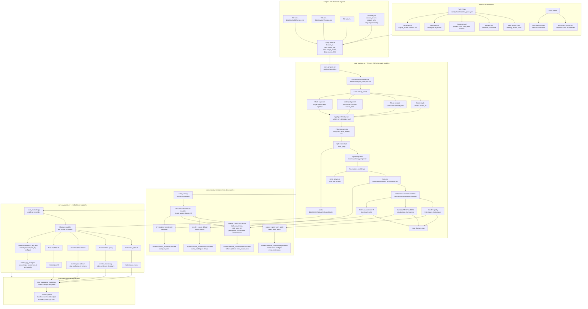
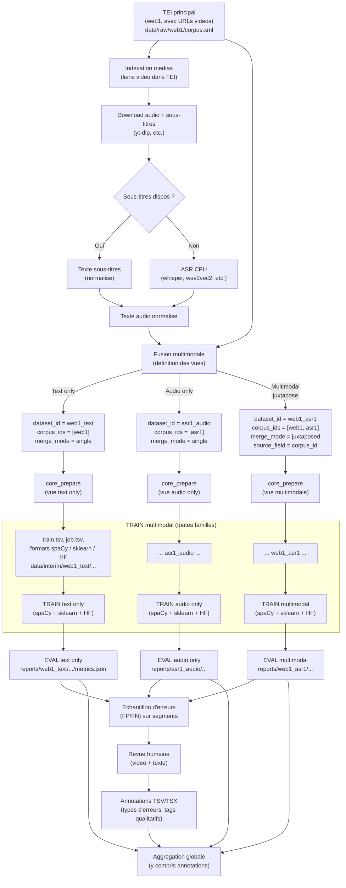
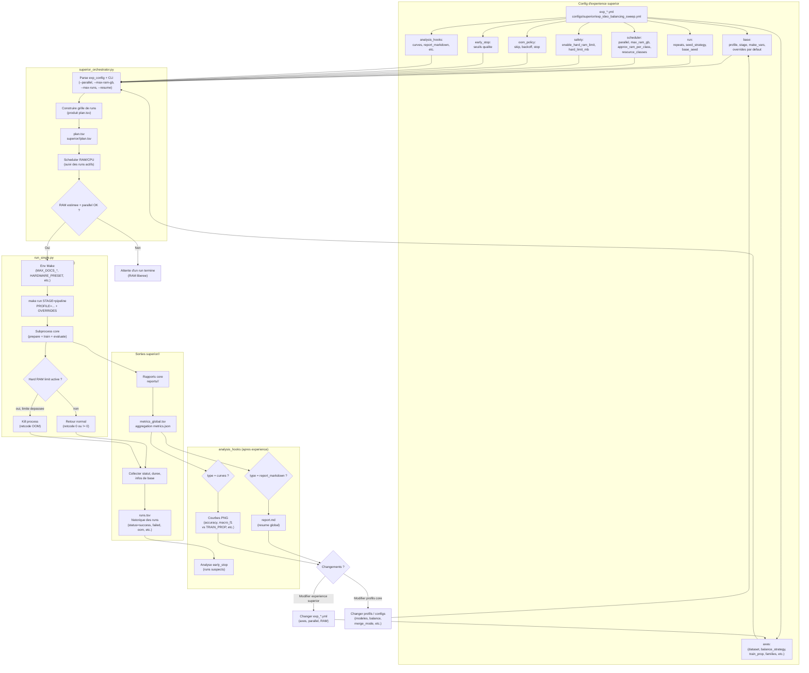

# PEPM_M1srbn-project-PEMP_V5.5-CPU

Pipeline **config-first** pour l’analyse de textes politiques (idéologie) à grande échelle, basé sur :

- un **corpus TEI XML** volumineux (≈ 3+ Go),
- un cœur **multi-corpus / multi-vues / multi-familles de modèles**,
- une logique d’**annotation idéologique dérivée** à partir d’un mapping *acteur → idéologie*,
- un entraînement **multi-méthodes** (spaCy, sklearn, HF) piloté par YAML.

Objectif : pouvoir lancer, rejouer et comparer des expériences complètes (préparation, entraînement, évaluation) uniquement via :

- des **profils YAML** (`configs/profiles/*.yml`),
- quelques **variables Makefile** (`PROFILE`, `CORPUS_ID`, etc.),
- des `--override key=val` pour les cas spécifiques,
- et, pour les campagnes systématiques, l’**orchestrateur V5** (`scripts/superior`).

Version : **V5.5 – CPU** (multi-corpus + orchestrateur `superior` + gestion RAM soft/hard).

---
### Credit pour ce projet :
*je souhaite poser un petit mot de remerciement pour les personnes qui m'ont aidé, et relu mon travail lors de ce projet, je cite :*
- Enzo Julien
- Camille Monnot (XD)
- Marco Faciolo

---

## 1. Vue d’ensemble

Le pipeline V5.5 repose sur trois scripts « cœur » :

- `scripts/core/core_prepare.py`
  ➜ TEI XML → TSV / formats entraînables (spaCy, sklearn, HF).

- `scripts/core/core_train.py`
  ➜ Entraîne les modèles listés dans `configs/common/models.yml` pour chaque **famille** (`check`, `spacy`, `sklearn`, `hf`).

- `scripts/core/core_evaluate.py`
  ➜ Charge les modèles, applique sur le jeu de test/job, produit des rapports dans `reports/...`.

Tout est piloté par un **profil** (`configs/profiles/ideo_quick.yml` par exemple).
Un profil peut être **mono-corpus** ou **multi-corpus**.

### 1.1. Corpus, dataset et multi-corpus

Deux niveaux :

1. **Corpus “brut”** (niveau TEI)
   Déclarés dans `configs/common/corpora.yml`, par exemple :

```yaml
   web1:
     corpus_id: web1
     corpus_path: data/raw/web1/corpus.xml
     language: fr
     default_modality: web

   asr1:
     corpus_id: asr1
     corpus_path: data/raw/asr1/corpus_asr.xml
     language: fr
     default_modality: asr
```

2. **Dataset logique** (`dataset_id`)
   Utilisé pour regrouper un ou plusieurs corpus (web1, asr1, web2…).

   Dans un profil :

   ```yaml
   dataset_id: web1_asr1

   data:
     corpus_ids: [web1, asr1]
     merge_mode: single | merged | juxtaposed | separate
     source_field: corpus_id
   ```

   * `corpus_ids` : liste de corpus (déclarés dans `corpora.yml`).
   * `merge_mode` :

     * `single`      : un seul corpus (mode historique V4),
     * `merged`      : fusion en un dataset unique (sans traçage détaillé de la source),
     * `juxtaposed`  : fusion + colonne `source_field` (ex. `corpus_id`) + métriques par source,
     * `separate`    : usage avancé (datasets séparés, souvent pilotés par l’orchestrateur).
   * `source_field` : nom de la colonne indiquant la source (ex. `corpus_id`, `modality`…).

Les chemins suivent ce schéma :

* **mono-corpus** :
  `data/interim/web1/ideology_global/`, `models/web1/ideology_global/`, `reports/web1/ideology_global/`

* **multi-corpus** (ex. `web1_asr1`) :
  `data/interim/web1_asr1/ideology_global/`, `models/web1_asr1/ideology_global/`, `reports/web1_asr1/ideology_global/`

### 1.2. Vue, familles de modèles, analyse

Dans un profil :

```yaml
view: ideology_global

families: [check, spacy, sklearn]

models_spacy:   [spacy_cnn_quick]
models_sklearn: [tfidf_svm_quick]
models_hf:      []          # facultatif
models_check:   [baseline]  # éventuellement
```

* **Vue** (`view`) détermine :

  * quels labels sont prédits,
  * où les données sont stockées (`.../<dataset_id>/<view>/`).

* **Familles de modèles** :

  * `check`   : baselines simples / sanity check,
  * `spacy`   : textcat spaCy,
  * `sklearn` : modèles BoW, TF-IDF, etc.,
  * `hf`      : modèles Transformers (HF).

* **Analyse multi-groupe** : bloc optionnel `analysis.compare_by` :

  ```yaml
  analysis:
    compare_by:
      - corpus_id
      - modality
  ```

  → génère des `metrics_by_<field>.json` (ex. `metrics_by_corpus_id.json`) dans `reports/<dataset_id>/<view>/<family>/<model_id>/` pour comparer les performances par source (web1 vs asr1, web2 vs web3, etc.).

### 1.3. Idéologie, hardware, équilibrage

* **Idéologie** :
  Basée sur les mappings YAML :

  * `configs/label_maps/ideology.yml` : base conceptuelle,
  * `configs/label_maps/ideology_actors.yml` : acteurs et labels,
  * `configs/label_maps/ideology_global.yml`, `ideology_left_intra.yml`, `ideology_right_intra.yml` : vues dérivées.

  Générés et mis à jour via :

  * `scripts/pre/make_ideology_skeleton.py`
  * `scripts/pre/derive_ideology_from_yaml.py`
  * cibles Make `ideology_skeleton`, `ideology_from_yaml`, `ideology_all`.

* **Hardware** (`configs/common/hardware.yml`) :
  Décrit des presets (`small`, `lab`, etc.) :

  * `max_train_docs_spacy`, `max_train_docs_sklearn`, `max_train_docs_hf`,
  * nb de threads BLAS,
  * options HF (batch size, etc.).

* **Équilibrage** (`configs/common/balance.yml`) :
  Regroupe les stratégies (`none`, `oversample`, `class_weight`…) et des presets (ex. `parity`) utilisés via :

  ```yaml
  balance_strategy: oversample
  balance_preset: parity
  ```

---

## 2. Installation & prérequis

### 2.1. Prérequis

* Python **3.10+** recommandé
* `git`, `make`
* CPU avec suffisamment de RAM (le pipeline est optimisé pour **CPU**, pas GPU)
* Un corpus TEI XML, par défaut dans :

  ```text
  data/raw/web1/corpus.xml
  ```

*(adapter `corpora.yml` + `CORPUS_ID` si tu utilises d’autres corpus)*

### 2.2. Installation rapide

Dans le répertoire racine du projet :

```bash
make setup
```

`make setup` enchaîne :

1. `make venv`
   → crée `.venv/` si nécessaire et installe `pip` à jour.
2. `make install`
   → installe les dépendances de `requirements.txt` dans `.venv`.
3. `make init_dirs`
   → crée l’arbo minimale sous `data/`, `models/`, `reports/`, `logs/`.
4. `make check PROFILE=ideo_quick`
   → diagnostics d’environnement + validation du profil par défaut.

Ensuite, place ton corpus dans :

```bash
ls -lh data/raw/web1/corpus.xml
```

### 2.3. Multi-corpus : ajout de nouveaux corpus

Pour ajouter un nouveau corpus (ex. `web2`, `asr2`) :

1. Ajouter le fichier TEI :

   ```text
   data/raw/web2/corpus.xml
   data/raw/asr2/corpus.xml
   ```

2. Mettre à jour `configs/common/corpora.yml` :

   ```yaml
   web2:
     corpus_id: web2
     corpus_path: data/raw/web2/corpus.xml
     language: fr
     default_modality: web

   asr2:
     corpus_id: asr2
     corpus_path: data/raw/asr2/corpus.xml
     language: fr
     default_modality: asr
   ```

3. Configurer un profil ou une expérience `superior` qui utilise ces IDs dans `data.corpus_ids`.

---

## 3. Organisation du dépôt

Schéma (adapté à la V5.5 actuelle) :

```text
.
├── configs
│   ├── common
│   │   ├── balance.yml           # stratégies d'équilibrage / presets
│   │   ├── corpora.yml           # liste des corpus (web1, asr1, web2…)
│   │   ├── hardware.yml          # presets hardware (small, lab, ...)
│   │   └── models.yml            # définition des modèles par famille
│   ├── label_maps
│   │   ├── ideology.yml          # base conceptuelle
│   │   ├── ideology_actors.yml   # mapping acteur → idéologie
│   │   ├── ideology_global.yml
│   │   ├── ideology_left_intra.yml
│   │   └── ideology_right_intra.yml
│   ├── profiles
│   │   ├── ideo_quick.yml        # profil principal, vue idéologie globale (rapide)
│   │   ├── ideo_full.yml         # version plus lourde
│   │   ├── ideo_quick_web1_asr1.yml  # exemple de profil multi-corpus
│   │   ├── crawl_quick.yml
│   │   ├── crawl_full.yml
│   │   ├── check_only.yml
│   │   ├── custom.yml
│   │   └── multi_demo.yml
│   └── superior
│       └── exp_ideo_balancing_sweep.yml   # expérience type pour l'orchestrateur
├── data
│   ├── raw
│   │   └── web1/corpus.xml       # corpus TEI principal (exemple)
│   ├── interim                   # TSV et formats intermédiaires
│   ├── processed                 # données prêtes pour train/eval
│   └── configs
│       └── actors_counts_web1.tsv
├── models                        # modèles entraînés (spaCy, sklearn, HF)
├── reports                       # métriques, rapports
├── scripts
│   ├── core
│   │   ├── core_prepare.py
│   │   ├── core_train.py
│   │   ├── core_evaluate.py
│   │   └── core_utils.py
│   ├── pre
│   │   ├── pre_check_env.py
│   │   ├── pre_check_config.py
│   │   ├── make_ideology_skeleton.py
│   │   └── derive_ideology_from_yaml.py
│   ├── post
│   │   └── post_aggregate_metrics.py
│   ├── tools
│   │   ├── corpus_stats.py
│   │   └── sysinfo.py
│   ├── superior
│   │   ├── run_single.py
│   │   └── superior_orchestrator.py
│   └── tests
│       ├── test_midlevel_demo.py
│       ├── test_multi_corpus_features.py
│       └── test_superior_orchestrator.py
├── logs                          # logs d'exécution (générés)
├── makefile
├── requirements.txt
├── doc_interne_V5.5.md           # doc dev interne (architecture détaillée)
├── dev_V4.md, dev_V5.md          # docs historiques (V4/V5)
└── old_version/                  # archives des versions anciennes
```

Les dossiers `logs/`, `data/interim/`, `data/processed/`, `models/`, `reports/` sont **générés** par les runs et peuvent être régénérés.

---

## 4. Logique du pipeline & modules

Cette section résume le cheminement complet d’un run, du TEI jusqu’aux métriques.

### 4.1. Configs & pré-checks

1. **Profil** (`configs/profiles/*.yml`)
   Décrit l’expérience logique : dataset, vue, familles, modèles, split, équilibrage, hardware.

2. **Pré-check** :

   * `scripts/pre/pre_check_env.py`
     Vérifie l’environnement Python (versions, modules, presets `hardware`).

   * `scripts/pre/pre_check_config.py`
     Valide la cohérence :

     * profil vs `corpora.yml`, `balance.yml`, `hardware.yml`, `models.yml`,
     * existence des chemins TEI.

   Commande typique :

   ```bash
   make check PROFILE=ideo_quick
   ```

### 4.2. Étape `prepare` (TEI → TSV / formats modèles)

Entrée principale :

* TEI XML dans `data/raw/<corpus_id>/corpus.xml` (mono-corpus),
* ou plusieurs TEI (multi-corpus) décrits dans `corpora.yml`.

`core_prepare.py` :

* lit les TEI (un ou plusieurs corpus),
* applique les **mappings d’idéologie** (via `ideology_actors.yml` et les vues dérivées),
* produit les fichiers :

  * `data/interim/<dataset_id>/<view>/job.tsv` :

    * lignes = documents,
    * colonnes : `doc_id`, texte, labels, métadonnées (ex. `corpus_id`, `modality`),
  * `data/interim/<dataset_id>/<view>/train.tsv` :

    * subset d’apprentissage (en fonction de `train_prop`),
  * formats spécifiques aux familles :

    * spaCy : dossiers avec `train.spacy`, `dev.spacy`, etc.,
    * sklearn : matrices sauvegardées ou joblib de vocabulaires,
    * HF : JSONLines ou équivalent.

Les options de debug (ex. `debug_mode`, `max_docs_debug`) peuvent être passées via `OVERRIDES`.

### 4.3. Étape `train` (entraînement des modèles)

`core_train.py` :

* lit les données préparées (`data/processed/...` ou `data/interim/...` selon la famille),

* instancie les modèles décrits dans `configs/common/models.yml` :

  ```yaml
  sklearn:
    tfidf_svm_quick:
      vectorizer: tfidf_char_wb
      classifier: linear_svm
      max_features: 200000
  ```

* respecte les limites de `hardware_preset` (ex. `max_train_docs_sklearn`),

* entraîne les modèles et sauvegarde :

  * spaCy : dossiers de modèles spaCy (`models/<dataset_id>/<view>/spacy/<model_id>/`),
  * sklearn : fichiers `.joblib` + méta (`models/.../sklearn/<model_id>/`),
  * HF : `config.json`, `pytorch_model.bin`, tokenizers, etc.

Meta-modèle (`meta_model.json`) dans chaque répertoire de modèle pour garder la trace de :

* profil,
* dataset_id,
* vue,
* paramètres de prétraitement (tokenisation, n-grammes…).

### 4.4. Étape `evaluate` (évaluation et rapports)

`core_evaluate.py` :

* recharge les modèles depuis `models/...`,
* lit `job.tsv` (ou un dataset d’éval séparé via `eval_dataset_id`),
* applique les modèles sur le jeu de test / job,
* calcule les métriques :

  * `accuracy`,
  * `macro_f1`, `weighted_f1`,
  * `precision`, `recall`,
  * éventuellement matrices de confusion.

Les sorties sont écrit dans :

* `reports/<dataset_id>/<view>/<family>/<model_id>/metrics.json`,
* `reports/<dataset_id>/<view>/<family>/<model_id>/metrics_by_<field>.json` pour chaque champ dans `analysis.compare_by`,
* éventuellement des rapports additionnels (classement, erreurs typiques, etc.).

### 4.5. Post-traitements

* `scripts/post/post_aggregate_metrics.py` permet de :

  * agréger plusieurs `metrics.json` (ex. runs différents) dans un tableau,
  * comparer rapidement des familles / modèles / presets matériels.

* D’autres analyses (courbes, rapport Markdown) peuvent être produites via l’orchestrateur (section suivante).

---

## 4.6. Orchestrateur `superior` (V5)

L’orchestrateur V5 (scripts `scripts/superior/`) permet de :

* définir des **grilles d’expériences** dans `configs/superior/*.yml`,
* lancer automatiquement des centaines de runs `make run STAGE=... PROFILE=...`,
* contrôler finement le **parallélisme** et la **pression RAM**,
* agréger les résultats (fichiers TSV globaux + courbes).

### 4.6.1. Structure d’une expérience `superior`

Exemple simplifié (`configs/superior/exp_ideo_balancing_sweep.yml`) :

```yaml
exp_id: ideo_balancing_sweep
description: >
  Étude de l'impact des stratégies d'équilibrage
  sur web1 et web1+asr1 avec le profil ideo_quick.

base:
  profile: ideo_quick
  stage: pipeline
  make_vars:
    HARDWARE_PRESET: small
    TRAIN_PROP: 0.8
  overrides:
    view: ideology_global

axes:
  - name: dataset
    type: choice
    values:
      - label: web1_only
        overrides:
          dataset_id: web1
          data.corpus_ids: [web1]
          data.merge_mode: single
          analysis.compare_by: []

      - label: web1_asr1_juxt
        overrides:
          dataset_id: web1_asr1
          data.corpus_ids: [web1, asr1]
          data.merge_mode: juxtaposed
          data.source_field: corpus_id
          analysis.compare_by: [corpus_id]

  - name: balance_strategy
    type: choice
    values:
      - label: no_balance
        make_vars:
          BALANCE_STRATEGY: none
      - label: oversample_parity
        make_vars:
          BALANCE_STRATEGY: oversample
          BALANCE_PRESET: parity
```

Les autres blocs :

* `grid`: mode d’exploration (`cartesian`, etc.),
* `run`: `repeats`, `seed_strategy`, `base_seed`,
* `scheduler`: contrôle du parallélisme et du budget RAM,
* `safety`: limite dure de RAM par run (optionnelle),
* `oom_policy`: que faire en cas d’OOM (`skip`, `backoff`, `stop`),
* `early_stop`: marque les runs de mauvaise qualité (log-only),
* `analysis_hooks`:

  * `curves`: génère des courbes (accuracy, F1…) en fonction d’un axe (ex. `TRAIN_PROP`),
  * `report_markdown`: génère un rapport Markdown global.

### 4.6.2. Exécution

L’orchestrateur s’utilise soit via la CLI directe :

```bash
source .venv/bin/activate

python -m scripts.superior.superior_orchestrator \
  --exp-config configs/superior/exp_ideo_balancing_sweep.yml \
  --parallel 2 \
  --max-ram-gb 14 \
  --resume
```

Soit via le Makefile :

```bash
make superior \
  SUPERIOR_EXP_CONFIG=configs/superior/exp_ideo_balancing_sweep.yml \
  SUPERIOR_PARALLEL=2 \
  SUPERIOR_MAX_RAM_GB=14
```

Les résultats sont écrits dans :

```text
superior/exp_ideo_balancing_sweep/
├── plan.tsv           # plan complet des runs
├── runs.tsv           # historique complet des runs (statut, métriques de base…)
├── logs/              # logs détaillés par run
├── metrics_global.tsv # agrégation globale des métriques
├── plots/             # courbes générées par le hook "curves"
└── report.md          # rapport Markdown (si configuré)
```

---

## 4.7. Gestion de la RAM (core + orchestrateur)

Deux niveaux complémentaires :

1. **Core (V4.x)** :
   Le profil + `hardware.yml` + `MAX_DOCS_*` doivent garantir qu’un **run isolé** tient dans la RAM :

   * limiter le nombre de documents (`max_train_docs_*`),
   * limiter la complexité des modèles (embedding, n-grammes, etc.),
   * limiter les threads BLAS.

2. **Orchestrateur (V5)** :

   * `parallel` : nombre max de runs simultanés,
   * `max_ram_gb` : budget RAM cible pour les runs *actifs*,
   * `approx_ram_per_class`: estimation de RAM pour chaque classe de ressource (`light`, `medium`, `heavy`),
   * `resource_classes`: mapping famille → classe (`spacy` = `heavy`, `sklearn` = `light`…).

   L’orchestrateur :

   * calcule un **coût mémoire estimé** des runs actifs,
   * tant que `sum(approx_ram) ≤ max_ram_gb`, il lance un nouveau run,
   * sinon, il attend qu’un run se termine → **soft limit** (pas de kill).

   Optionnellement, on peut activer une **hard limit par run** via `safety.enable_hard_ram_limit` + `hard_limit_mb` :

   * `run_single.py` surveille la RAM réelle du process (via `psutil`),
   * si `RSS > hard_limit_mb` : le run est tué, et retourne un code OOM (`99`),
   * l’orchestrateur enregistre alors `status="oom"` dans `runs.tsv` et applique `oom_policy`.

En pratique, l’usage recommandé est :

1. calibrer les presets `hardware` pour qu’un run seul soit safe ;
2. utiliser `parallel` + `max_ram_gb` + `approx_ram_per_class` pour contrôler la pression globale ;
3. n’activer la hard limit (`safety.enable_hard_ram_limit`) que pour des campagnes très lourdes où l’on préfère *tuer* les runs aberrants plutôt que risquer un crash.

---

## 5. Séquence de commandes : démarrage + tests RAM

Cette section résume les commandes clés pour :

1. démarrer et vérifier le pipeline,
2. tester la résistance à la saturation de RAM (soft limit via l’orchestrateur, et hard limit optionnelle).

### 5.1. Bootstrap & sanity check

Dans le répertoire racine du projet :

```bash
cd ~/prog/PEPM_M1srbn-project-PEMP_V5.5-CPU-main

# 1) venv + install + init_dirs + check
make setup

# 2) infos système (CPU, RAM, Python, etc.)
make sysinfo

# 3) vérifier que tous les scripts Python compilent
make check_scripts

# 4) check complet du profil ideo_quick
make check PROFILE=ideo_quick
```

### 5.2. Core seul – mono-corpus (web1)

Assure-toi d’abord que le corpus TEI est bien présent :

```bash
ls -lh data/raw/web1/corpus.xml
```

Puis lance le pipeline complet :

```bash
make run STAGE=pipeline PROFILE=ideo_quick
```

Ou les étapes séparément :

```bash
make run STAGE=prepare  PROFILE=ideo_quick
make run STAGE=train    PROFILE=ideo_quick
make run STAGE=evaluate PROFILE=ideo_quick
```

Vérifications rapides :

```bash
tree data/interim/web1
tree reports/web1/ideology_global
```

### 5.3. Orchestrateur `superior` – plan + exécution

#### 5.3.1. Dry-run (générer le plan sans exécuter)

```bash
source .venv/bin/activate

python -m scripts.superior.superior_orchestrator \
  --exp-config configs/superior/exp_ideo_balancing_sweep.yml \
  --parallel 2 \
  --max-ram-gb 14 \
  --dry-run
```

Tu dois voir apparaître :

```bash
ls superior
tree superior/exp_ideo_balancing_sweep
# notamment : plan.tsv
```

#### 5.3.2. Run réel

Mode séquentiel :

```bash
SUPERIOR_PARALLEL=1 SUPERIOR_MAX_RAM_GB=14 make superior
```

Mode parallèle modéré :

```bash
SUPERIOR_PARALLEL=3 SUPERIOR_MAX_RAM_GB=14 make superior
```

Puis inspecter :

```bash
cat superior/exp_ideo_balancing_sweep/runs.tsv | column -t -s$'\t' | less -S
ls superior/exp_ideo_balancing_sweep/metrics_global.tsv
ls superior/exp_ideo_balancing_sweep/plots
```

### 5.4. Test de résistance RAM (soft limit)

Objectif : vérifier que le scheduler limite le nombre de runs simultanés pour ne pas saturer la RAM.

Dans `configs/superior/exp_ideo_balancing_sweep.yml`, un exemple typique :

```yaml
scheduler:
  parallel: 8
  max_ram_gb: 14
  approx_ram_per_class:
    light: 2.0
    medium: 4.0
    heavy: 6.0
  resource_classes:
    check: light
    sklearn: light
    spacy: heavy
    hf: heavy
```

Puis :

```bash
SUPERIOR_PARALLEL=8 SUPERIOR_MAX_RAM_GB=14 make superior
```

En parallèle, ouvre `htop` :

* le nombre de `python -m scripts.superior.run_single` actifs doit rester limité,
* la RAM globale ne doit pas coller en permanence à 100 %.

Pour pousser le test, tu peux temporairement baisser `SUPERIOR_MAX_RAM_GB` (par ex. 8) et relancer : tu dois voir moins de runs simultanés.

### 5.5. Test de hard limit RAM (optionnel, chemin OOM)

Ce test sert uniquement à vérifier que la chaîne de gestion OOM fonctionne (hard kill par run), si tu l’actives.

Dans `configs/superior/exp_ideo_balancing_sweep.yml` :

```yaml
safety:
  enable_hard_ram_limit: true
  hard_limit_mb: 6000   # ~6 Go par run
```

Puis :

```bash
SUPERIOR_PARALLEL=1 SUPERIOR_MAX_RAM_GB=14 make superior
```

Surveiller :

* dans `htop`, un run qui dépasse ~6 Go doit être tué,
* dans `superior/exp_ideo_balancing_sweep/runs.tsv`, ce run doit apparaître avec un statut de type `oom` / `skipped_oom` / `skipped_oom_backoff` (selon ta politique),
* les autres runs continuent normalement (ou sont marqués selon `oom_policy`).

En pratique pour un usage normal, il est recommandé de :

1. calibrer les presets `hardware` et `MAX_DOCS_*` pour que **un run seul** soit safe ;
2. utiliser `parallel` + `max_ram_gb` + `approx_ram_per_class` pour contrôler la pression RAM globale ;
3. n’activer la **hard limit** (`enable_hard_ram_limit`) que pour des campagnes d’expériences très lourdes où tu préfères tuer les runs aberrants

## 6. Scénarios de lancement A → Z (uniquement Makefile)

Cette section donne des **recettes complètes** de lancement, de la plus simple à la plus avancée, en utilisant **uniquement les commandes `make`** (sans appeler directement les scripts Python).

### 6.1. Scénario 1 – Premier lancement minimal (web1, ideo_quick)

Objectif : tester le pipeline complet sur le corpus de base `web1` avec le profil standard `ideo_quick`.

1. Création de l’environnement, installation des dépendances, création de l’arbo de base et check rapide :

```bash
   make setup
```

2. Copier (ou vérifier) le corpus TEI dans :

   ```bash
   ls -lh data/raw/web1/corpus.xml
   ```

3. Lancer le pipeline complet (check + prepare + train + evaluate) :

   ```bash
   make run STAGE=pipeline PROFILE=ideo_quick
   ```

4. Vérifier rapidement les sorties :

   ```bash
   tree data/interim/web1
   tree reports/web1/ideology_global
   ```

---

### 6.2. Scénario 2 – Lancement avec diagnostics détaillés

Objectif : passer par tous les diagnostics avant de lancer le pipeline.

1. Infos système :

   ```bash
   make sysinfo
   ```

2. Vérification syntaxique de tous les scripts Python :

   ```bash
   make check_scripts
   ```

3. Vérification de l’environnement + du profil (cohérence configs/corpus) :

   ```bash
   make check PROFILE=ideo_quick
   ```

4. Générer (ou regénérer) les mappings d’idéologie :

   * Squelette d’acteurs (YAML + rapport) :

     ```bash
     make ideology_skeleton \
       CORPUS_ID=web1 \
       CORPUS_XML=data/raw/web1/corpus.xml \
       IDEO_MAP_OUT=configs/label_maps/ideology_actors.yml \
       IDEO_REPORT_OUT=data/configs/actors_counts_web1.tsv
     ```

   * Dériver les vues globales et intra à partir de `ideology.yml` :

     ```bash
     make ideology_from_yaml \
       IDEOLOGY_BASE=configs/label_maps/ideology.yml \
       IDEO_MAP_OUT=configs/label_maps/ideology_actors.yml
     ```

   * Enchaîner les deux :

     ```bash
     make ideology_all
     ```

5. Lancer ensuite le pipeline complet sereinement :

   ```bash
   make run STAGE=pipeline PROFILE=ideo_quick
   ```

---

### 6.3. Scénario 3 – Run de debug / petit sous-ensemble de documents

Objectif : tester le pipeline sur un **échantillon réduit**, pour déboguer plus vite et limiter la RAM.

1. Limiter le nombre de documents d’entraînement par famille via les variables Make :

   ```bash
   make run STAGE=pipeline PROFILE=ideo_quick \
     MAX_DOCS_SKLEARN=2000 \
     MAX_DOCS_SPACY=2000 \
     MAX_DOCS_HF=500
   ```

2. Ajouter en plus un mode debug via `OVERRIDES` (si le profil le supporte) :

   ```bash
   make run STAGE=prepare PROFILE=ideo_quick \
     MAX_DOCS_SKLEARN=2000 \
     MAX_DOCS_SPACY=2000 \
     OVERRIDES="debug_mode=true max_docs_debug=1000"
   ```

3. Enchaîner ensuite `train` et `evaluate` sur ces données réduites :

   ```bash
   make run STAGE=train PROFILE=ideo_quick \
     MAX_DOCS_SKLEARN=2000 \
     MAX_DOCS_SPACY=2000

   make run STAGE=evaluate PROFILE=ideo_quick
   ```

---

### 6.4. Scénario 4 – Mono-corpus vs multi-corpus (avec overrides Make)

Objectif : montrer comment passer d’un corpus simple à un dataset multi-corpus **sans créer un nouveau profil**, uniquement avec `CORPUS_ID` et `OVERRIDES`.

#### 6.4.1. Changer simplement de corpus (mono-corpus)

En supposant que `data/raw/web2/corpus.xml` est renseigné dans `corpora.yml` :

```bash
make run STAGE=pipeline PROFILE=ideo_quick CORPUS_ID=web2
```

Ici :

* `CORPUS_ID=web2` se transforme en `--override corpus_id=web2`,
* le profil reste le même (`ideo_quick`), mais il pointe sur `web2`.

#### 6.4.2. Multi-corpus juxtaposé (ex. web1 + asr1)

Cas où tu veux :

* fusionner `web1` et `asr1`,
* garder une colonne `corpus_id` pour comparer les performances,
* écrire les résultats dans un dataset logique `web1_asr1`.

Tu peux le faire via `OVERRIDES` :

```bash
make run STAGE=pipeline PROFILE=ideo_quick \
  OVERRIDES="dataset_id=web1_asr1 \
             data.corpus_ids=[web1,asr1] \
             data.merge_mode=juxtaposed \
             data.source_field=corpus_id \
             analysis.compare_by=[corpus_id]"
```

Effet :

* `core_prepare` lit les TEI de `web1` et `asr1`,
* écrit les TSV dans `data/interim/web1_asr1/ideology_global/`,
* `core_train` et `core_evaluate` écrivent les modèles/rapports sous `models/web1_asr1/...` et `reports/web1_asr1/...`,
* `metrics_by_corpus_id.json` permet de comparer les performances web1 vs asr1.

---

### 6.5. Scénario 5 – Superior A → Z (Makefile uniquement)

Objectif : réaliser une **campagne d’expériences** avec l’orchestrateur `superior`, en ne manipulant que le Makefile.

#### 6.5.1. Lancer l’expérience par défaut

La cible `superior` utilise par défaut :

* `SUPERIOR_EXP_CONFIG = configs/superior/exp_ideo_balancing_sweep.yml`,
* `SUPERIOR_PARALLEL = 1`,
* `SUPERIOR_MAX_RAM_GB = 14`.

Lancement :

```bash
make superior
```

Cela :

* lit la config `configs/superior/exp_ideo_balancing_sweep.yml`,
* génère un plan de runs (si nécessaire),
* exécute les runs un par un (`parallel=1`),
* respecte un budget RAM soft de 14 Go (`max_ram_gb`),
* écrit les résultats dans `superior/exp_ideo_balancing_sweep/`.

#### 6.5.2. Contrôler le parallélisme et le budget RAM

Pour exploiter davantage le CPU, tout en limitant la RAM :

```bash
make superior \
  SUPERIOR_EXP_CONFIG=configs/superior/exp_ideo_balancing_sweep.yml \
  SUPERIOR_PARALLEL=4 \
  SUPERIOR_MAX_RAM_GB=14
```

Ici :

* `SUPERIOR_PARALLEL=4` : jusqu’à 4 runs simultanés,
* `SUPERIOR_MAX_RAM_GB=14` : l’orchestrateur limite le nombre de runs actifs en fonction de ce budget (soft limit), en utilisant `approx_ram_per_class` et `resource_classes` définis dans le YAML d’expérience.

#### 6.5.3. Reprendre une expérience interrompue

La cible `superior` passe toujours `--resume` à l’orchestrateur, qui :

* relit `runs.tsv`,
* ne relance pas les runs déjà marqués `success`,
* ne relance que les runs absents ou en `failed`/`oom` (selon la logique implémentée).

Un simple :

```bash
make superior SUPERIOR_PARALLEL=2 SUPERIOR_MAX_RAM_GB=12
```

permet donc de **reprendre** une expérience existante avec un autre niveau de parallélisme / budget RAM, sans toucher au YAML.

#### 6.5.4. Changer d’expérience superior

Si tu crées une nouvelle config, par exemple `configs/superior/exp_ideo_multi_modal.yml`, tu peux l’utiliser directement :

```bash
make superior \
  SUPERIOR_EXP_CONFIG=configs/superior/exp_ideo_multi_modal.yml \
  SUPERIOR_PARALLEL=3 \
  SUPERIOR_MAX_RAM_GB=12
```

Le reste (logs, runs.tsv, métriques globales, plots) sera écrit dans :

```text
superior/exp_ideo_multi_modal/
```

---

### 6.6. Scénario 6 – Du plus simple au plus complexe en un coup d’œil

Récapitulatif rapide des commandes Make dans l’ordre de complexité :

1. **Bootstrap minimal** :

   ```bash
   make setup
   ```

2. **Diagnostics complets** :

   ```bash
   make sysinfo
   make check_scripts
   make check PROFILE=ideo_quick
   ```

3. **Pipeline basique sur web1** :

   ```bash
   make run STAGE=pipeline PROFILE=ideo_quick
   ```

4. **Pipeline basique sur un autre corpus (mono-corpus)** :

   ```bash
   make run STAGE=pipeline PROFILE=ideo_quick CORPUS_ID=web2
   ```

5. **Pipeline debug (petit sous-ensemble)** :

   ```bash
   make run STAGE=pipeline PROFILE=ideo_quick \
     MAX_DOCS_SKLEARN=2000 \
     MAX_DOCS_SPACY=2000 \
     MAX_DOCS_HF=500
   ```

6. **Pipeline multi-corpus juxtaposé (web1 + asr1)** :

   ```bash
   make run STAGE=pipeline PROFILE=ideo_quick \
     OVERRIDES="dataset_id=web1_asr1 \
                data.corpus_ids=[web1,asr1] \
                data.merge_mode=juxtaposed \
                data.source_field=corpus_id \
                analysis.compare_by=[corpus_id]"
   ```

7. **Campagne superior par défaut (exp_ideo_balancing_sweep)** :

   ```bash
   make superior
   ```

8. **Campagne superior avec parallélisme et RAM adaptés** :

   ```bash
   make superior \
     SUPERIOR_EXP_CONFIG=configs/superior/exp_ideo_balancing_sweep.yml \
     SUPERIOR_PARALLEL=4 \
     SUPERIOR_MAX_RAM_GB=14
   ```

9. **Campagne superior avec une autre expérience** :

   ```bash
   make superior \
     SUPERIOR_EXP_CONFIG=configs/superior/exp_ideo_multi_modal.yml \
     SUPERIOR_PARALLEL=3 \
     SUPERIOR_MAX_RAM_GB=12
   ```
---

## 7. Comprendre et surveiller l’usage mémoire (RAM)

Le pipeline peut consommer beaucoup de RAM (plusieurs dizaines de Go) sur des corpus volumineux (ex. TEI de 3+ Go) avec plusieurs familles de modèles. Cette section explique :

1. pourquoi l’usage mémoire peut monter très haut,
2. pourquoi certains outils (KDE, Kate…) montrent des chiffres surprenants,
3. comment interpréter correctement ces chiffres,
4. comment **contrôler** et **limiter** la consommation mémoire.

### 7.1. Pourquoi le pipeline consomme autant ?

Le pipeline manipule :

- des **fichiers TEI XML volumineux**, compressés sur disque mais **décompressés en RAM**,
- des structures Python (listes de documents, DataFrames, dictionnaires),
- des représentations internes pour :
  - la tokenisation,
  - les labels et métadonnées,
  - les vecteurs **BoW / TF-IDF** (sklearn),
  - les objets spaCy / HF.

Sur un gros corpus, même en mode CPU, il est normal d’atteindre :

- 8–10 GiB pour un run “raisonnable”,
- 15–20 GiB pour un run **très lourd** (corpus complet, gros n-grammes, HF, etc.).

La consommation dépend directement de :

- la taille du corpus,
- des paramètres d’entraînement (`max_train_docs_*`, n-grammes, embeddings…),
- du nombre de **runs simultanés** (parallélisme via `superior`).

### 7.2. Pourquoi “Kate” semble utiliser 18+ GiB ?

Sous KDE, si tu lances le pipeline dans un **terminal intégré à Kate** :

- le process Python du pipeline est un **processus enfant** de Kate,
- certains moniteurs de ressources **agrègent** la mémoire du parent + enfants et l’affichent sur la ligne du parent.

Résultat typique :

- dans le moniteur, tu vois quelque chose comme :

  > `Kate   5,0 % CPU   17,9 GiB RAM`

- en réalité, ces 17,9 GiB correspondent à :
  - Kate lui-même,
  - **+** le process Python du pipeline,
  - **+** les threads BLAS / sous-process HF, etc.

Ce n’est donc **pas un “paramétrage pipeline à 17,9 Go”**, mais simplement la somme de tout l’arbre de processus.

#### 7.2.1. Vérifier avec `ps` / `htop`

Pour voir qui consomme vraiment quoi, il est recommandé de lancer le pipeline dans une **Konsole séparée** et d’utiliser :

```bash
ps -o pid,ppid,cmd,%mem,rss --sort=-rss | head -n 20
````

ou `htop` en mode “arbre de processus” :

* tu verras clairement le process `python -m scripts.core.core_train` ou `run_single`,
* tu pourras distinguer la RAM de Kate (éditeur) de celle du pipeline.

### 7.3. “17,5 Go” dans les logs : RAM totale de la machine

Certains scripts (ex. `sysinfo.py`) affichent la **RAM totale détectée** via `psutil` :

```python
import psutil
total_ram_gb = psutil.virtual_memory().total / 1e9
```

Sur une machine 16 GiB, cela donne un chiffre autour de :

* `16 * 1024^3 / 1e9 ≈ 17,2–17,5 GB`

Donc :

* **17,5 Go dans les logs** = RAM **totale** de la machine,
* **17,9 GiB dans le moniteur KDE** = **RAM réellement utilisée** par Kate + le pipeline à un instant T.

Ce sont deux informations différentes.

### 7.4. Paramètres pour limiter ou répartir l’usage mémoire

Plusieurs niveaux de contrôle sont disponibles.

#### 7.4.1. Taille des jeux d’entraînement (core)

Dans les commandes `make`, tu peux :

* utiliser un **preset hardware** plus léger :

  ```bash
  make run STAGE=pipeline PROFILE=ideo_quick HARDWARE_PRESET=small
  ```

* limiter le nombre de documents d’entraînement :

  ```bash
  make run STAGE=pipeline PROFILE=ideo_quick \
    MAX_DOCS_SKLEARN=2000 \
    MAX_DOCS_SPACY=2000 \
    MAX_DOCS_HF=500
  ```

Ces variables sont transformées en `--override max_train_docs_*` et réduisent directement la quantité de données chargées / vectorisées.

#### 7.4.2. Parallélisme et limite “soft” (orchestrateur superior)

Dans `configs/superior/exp_*.yml`, le bloc `scheduler` contrôle le parallélisme et un budget RAM **soft** :

```yaml
scheduler:
  parallel: 8
  max_ram_gb: 14
  approx_ram_per_class:
    light: 2.0
    medium: 4.0
    heavy: 6.0
  resource_classes:
    check: light
    sklearn: light
    spacy: heavy
    hf: heavy
```

* `parallel` : nombre max de runs *simultanés*,
* `max_ram_gb` : budget RAM cible,
* `approx_ram_per_class` : estimation de consommation par “classe” de run,
* `resource_classes` : mapping famille → classe.

---


1. Core V5.5 – multi-corpus / multi-familles



2. Pipeline texte + audio/ASR (vue multimodale)


3. Orchestrateur V5.5 – superior


