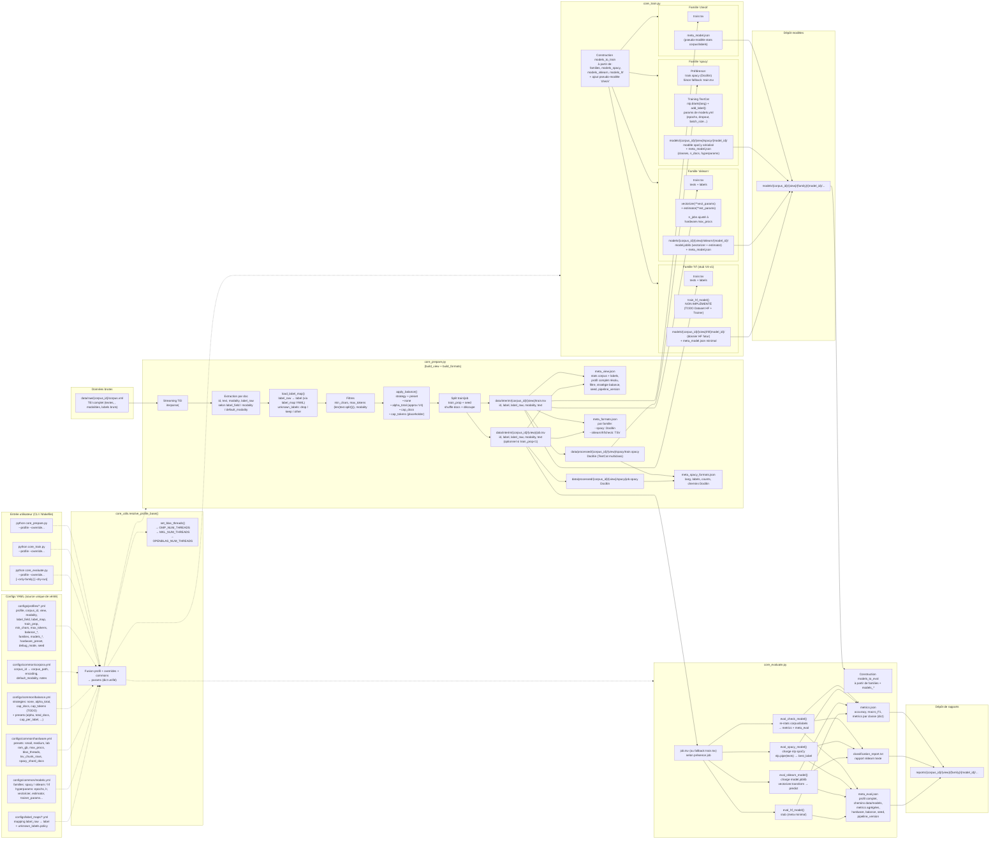
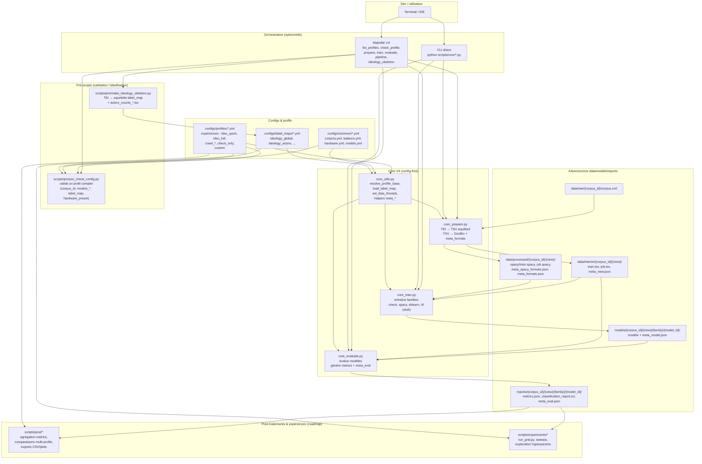
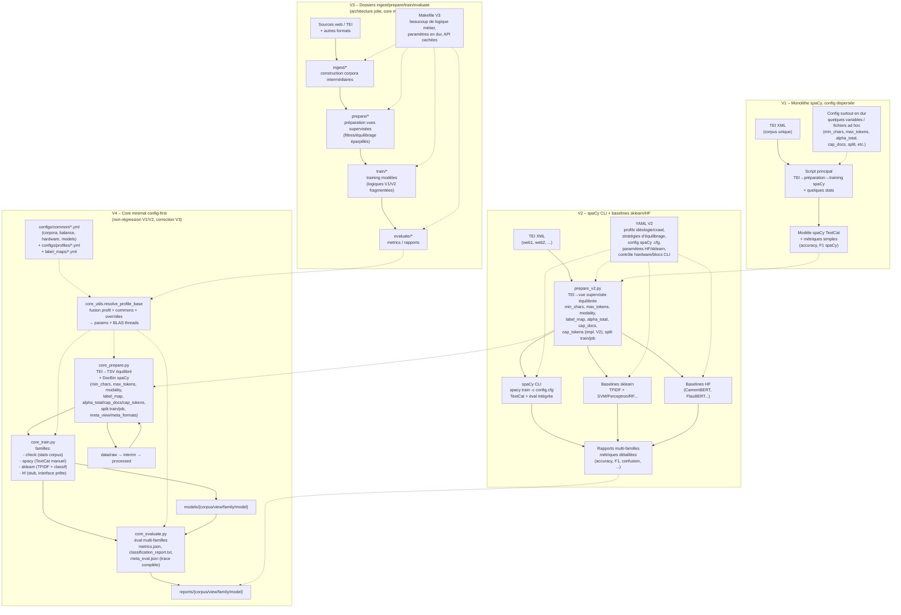

1. Core V4

```mermaid
flowchart LR
  %% ===================== ENTRÉE CLI / MAKEFILE =====================
  subgraph CLI ["Entrée utilisateur (CLI / Makefile)"]
    cli_prepare["python core_prepare.py\n--profile --override..."]
    cli_train["python core_train.py\n--profile --override..."]
    cli_eval["python core_evaluate.py\n--profile --override...\n[--only-family] [--dry-run]"]
  end

  %% ===================== CONFIGS =====================
  subgraph CONFIGS ["Configs YAML (source unique de vérité)"]
    cfg_profile["configs/profiles/*.yml\nprofile, corpus_id, view, modality,\nlabel_field, label_map, train_prop,\nmin_chars, max_tokens, balance_*,\nfamilies, models_*, hardware_preset,\ndebug_mode, seed"]
    cfg_corpora["configs/common/corpora.yml\ncorpus_id → corpus_path, encoding,\ndefault_modality, notes"]
    cfg_balance["configs/common/balance.yml\nstrategies: none, alpha_total,\ncap_docs, cap_tokens (TODO)\n+ presets (alpha, total_docs, cap_per_label, ...)"]
    cfg_hardware["configs/common/hardware.yml\npresets: small, medium, lab\nram_gb, max_procs, blas_threads,\ntsv_chunk_rows, spacy_shard_docs"]
    cfg_models["configs/common/models.yml\nfamilles: spacy / sklearn / hf\nhyperparams: epochs, lr,\nvectorizer, estimator, trainer_params..."]
    cfg_labelmaps["configs/label_maps/*.yml\nmapping label_raw → label\n+ unknown_labels.policy"]
  end

  %% ===================== CORE_UTILS =====================
  subgraph CORE_UTILS ["core_utils.resolve_profile_base()"]
    core_utils["Fusion profil + overrides + commons\n→ params (dict unifié)"]
    blas_env["set_blas_threads()\n→ OMP_NUM_THREADS\n→ MKL_NUM_THREADS\n→ OPENBLAS_NUM_THREADS"]
  end

  %% ===================== DONNÉES BRUTES =====================
  subgraph RAW ["Données brutes"]
    tei_xml["data/raw/{corpus_id}/corpus.xml\nTEI complet (textes, <term>, modalities, labels bruts)"]
  end

  %% ===================== PREPARE =====================
  subgraph PREPARE ["core_prepare.py\n(build_view + build_formats)"]
    prep_stream["Streaming TEI\niterparse(<text>) + elem.clear()"]
    prep_extract["Extraction par doc\nid, text, modality, label_raw\nselon label_field / modality / default_modality"]
    prep_labelmap["load_label_map()\nlabel_raw → label (via label_map YAML)\nunknown_labels: drop / keep / other"]
    prep_filters["Filtres\nmin_chars, max_tokens (len(text.split())), modality"]
    prep_balance["apply_balance()\nstrategy + preset\n• none\n• alpha_total (approx V4)\n• cap_docs\n• cap_tokens (placeholder)"]
    prep_split["Split train/job\ntrain_prop + seed\nshuffle docs + découpe"]
    tsv_train["data/interim/{corpus_id}/{view}/train.tsv\nid, label, label_raw, modality, text"]
    tsv_job["data/interim/{corpus_id}/{view}/job.tsv\nid, label, label_raw, modality, text\n(optionnel si train_prop<1)"]
    meta_view["meta_view.json\nstats corpus + labels,\nprofil complet résolu,\nfiltre, stratégie balance,\nseed, pipeline_version"]
    spacy_train["data/processed/{corpus_id}/{view}/spacy/train.spacy\nDocBin (TextCat multiclass)"]
    spacy_job["data/processed/{corpus_id}/{view}/spacy/job.spacy\nDocBin"]
    meta_spacy_formats["meta_spacy_formats.json\nlang, labels, counts, chemins DocBin"]
    meta_formats["meta_formats.json\npar famille:\n- spacy: DocBin\n- sklearn/hf/check: TSV"]
  end

  %% ===================== TRAIN =====================
  subgraph TRAIN_CORE ["core_train.py"]
    train_select_models["Construction models_to_train\nà partir de:\n families, models_spacy,\n models_sklearn, models_hf\n+ ajout pseudo-modèle 'check'"]

    subgraph TRAIN_CHECK ["Famille 'check'"]
      check_in["train.tsv"]
      check_out["meta_model.json\n(pseudo-modèle stats corpus/labels)"]
    end

    subgraph TRAIN_SPACY ["Famille 'spacy'"]
      spacy_in["Préférence:\ntrain.spacy (DocBin)\nSinon fallback: train.tsv"]
      spacy_train_loop["Training TextCat\nnlp.blank(lang) + add_label()\nparams de models.yml\n(epochs, dropout, batch_size...)"]
      spacy_model_dir["models/{corpus_id}/{view}/spacy/{model_id}/\nmodèle spaCy sérialisé\n+ meta_model.json\n(classes, n_docs, hyperparams)"]
    end

    subgraph TRAIN_SK ["Famille 'sklearn'"]
      sk_in["train.tsv\ntexts + labels"]
      sk_vec_clf["vectorizer(**vect_params)\n+ estimator(**est_params)\n\nn_jobs ajusté à\nhardware.max_procs"]
      sk_model_dir["models/{corpus_id}/{view}/sklearn/{model_id}/\nmodel.joblib (vectorizer + estimator)\n+ meta_model.json"]
    end

    subgraph TRAIN_HF ["Famille 'hf' (stub V4-v1)"]
      hf_in["train.tsv\ntexts + labels"]
      hf_stub["train_hf_model()\nNON IMPLÉMENTÉ\n(TODO Dataset HF + Trainer)"]
      hf_model_dir["models/{corpus_id}/{view}/hf/{model_id}/\n(dossier HF futur)\n+ meta_model.json minimal"]
    end
  end

  subgraph MODELS_STORE ["Dépôt modèles"]
    models_store["models/{corpus_id}/{view}/{family}/{model_id}/..."]
  end

  %% ===================== EVAL =====================
  subgraph EVAL_CORE ["core_evaluate.py"]
    eval_load_models["Construction models_to_eval\nà partir de families + models_*"]
    eval_job_src["job.tsv (ou fallback train.tsv)\nselon présence job"]
    eval_check["eval_check_model()\nre-stats corpus/labels\n→ metrics + meta_eval"]
    eval_spacy["eval_spacy_model()\ncharge nlp spaCy\nnlp.pipe(texts) → best_label"]
    eval_sk["eval_sklearn_model()\ncharge model.joblib\nvectorizer.transform → predict"]
    eval_hf["eval_hf_model()\nstub (meta minimal)"]
    metrics_json["metrics.json\naccuracy, macro_F1,\nmetrics par classe (dict)"]
    clf_report["classification_report.txt\nrapport sklearn texte"]
    meta_eval["meta_eval.json\nprofil complet,\nchemins data/models,\nmetrics agrégées,\nhardware, balance, seed,\npipeline_version"]
  end

  subgraph REPORTS_STORE ["Dépôt de rapports"]
    reports_store["reports/{corpus_id}/{view}/{family}/{model_id}/..."]
  end

  %% ===================== FLUX DE PARAMÈTRES (POINTILLÉ) =====================
  cli_prepare -.-> core_utils
  cli_train -.-> core_utils
  cli_eval -.-> core_utils

  cfg_profile -.-> core_utils
  cfg_corpora -.-> core_utils
  cfg_balance -.-> core_utils
  cfg_hardware -.-> core_utils
  cfg_models -.-> core_utils
  cfg_labelmaps -.-> core_utils

  core_utils -.-> blas_env
  core_utils -.-> PREPARE
  core_utils -.-> TRAIN_CORE
  core_utils -.-> EVAL_CORE

  %% ===================== FLUX DE DONNÉES (PLEIN) =====================
  tei_xml --> prep_stream --> prep_extract --> prep_labelmap --> prep_filters --> prep_balance --> prep_split
  prep_split --> tsv_train
  prep_split --> tsv_job
  tsv_train --> meta_view
  tsv_job --> meta_view
  tsv_train --> spacy_train --> meta_spacy_formats
  tsv_job --> spacy_job --> meta_spacy_formats
  tsv_train --> meta_formats
  tsv_job --> meta_formats

  %% TRAIN
  tsv_train --> check_in
  tsv_train --> sk_in
  tsv_train --> hf_in
  spacy_train --> spacy_in

  check_out --> models_store
  spacy_model_dir --> models_store
  sk_model_dir --> models_store
  hf_model_dir --> models_store

  train_select_models --> TRAIN_CHECK
  train_select_models --> TRAIN_SPACY
  train_select_models --> TRAIN_SK
  train_select_models --> TRAIN_HF

  %% EVAL
  models_store --> eval_load_models
  tsv_job --> eval_job_src

  eval_job_src --> eval_check
  eval_job_src --> eval_spacy
  eval_job_src --> eval_sk
  eval_job_src --> eval_hf

  eval_check --> metrics_json
  eval_spacy --> metrics_json
  eval_sk --> metrics_json
  eval_hf --> metrics_json

  eval_check --> clf_report
  eval_spacy --> clf_report
  eval_sk --> clf_report

  eval_check --> meta_eval
  eval_spacy --> meta_eval
  eval_sk --> meta_eval
  eval_hf --> meta_eval

  metrics_json --> reports_store
  clf_report --> reports_store
  meta_eval --> reports_store
```

2. Architecture globale V4

```mermaid
flowchart TB
  %% ===================== UTILISATEUR =====================
  subgraph USER ["Dev / utilisateur"]
    user_shell["Terminal / IDE"]
  end

  %% ===================== ORCHESTRATION =====================
  subgraph ORCH ["Orchestration (optionnelle)"]
    make_v4["Makefile V4\nlist_profiles, check_profile,\nprepare, train, evaluate, pipeline,\nideology_skeleton"]
    cli_direct["CLI direct\npython scripts/core/*.py"]
  end

  %% ===================== SCRIPTS PRE =====================
  subgraph PRE_SCRIPTS ["Pré-scripts (validation / labellisation)"]
    pre_check["scripts/pre/pre_check_config.py\nvalide un profil complet\n(corpus_id, models_*, label_map,\nhardware_preset)"]
    ideo_skel["scripts/pre/make_ideology_skeleton.py\nTEI → squelette label_map\n+ actors_counts_*.tsv"]
  end

  %% ===================== CONFIGS =====================
  subgraph CFG ["Configs & profils"]
    cfg_prof["configs/profiles/*.yml\nexpériences : ideo_quick, ideo_full,\n crawl_*, check_only, custom"]
    cfg_common["configs/common/*.yml\ncorpora.yml, balance.yml,\nhardware.yml, models.yml"]
    cfg_labels["configs/label_maps/*.yml\nideology_global, ideology_actors, ..."]
  end

  %% ===================== CORE SCRIPTS =====================
  subgraph CORE ["Core V4 (config-first)"]
    core_utils_script["core_utils.py\nresolve_profile_base,\nload_label_map, set_blas_threads,\nhelpers meta_*"]
    core_prepare_script["core_prepare.py\nTEI → TSV équilibré\nTSV → DocBin + meta_formats"]
    core_train_script["core_train.py\nentraîne familles:\ncheck, spacy, sklearn, hf (stub)"]
    core_eval_script["core_evaluate.py\névalue modèles\ngénère metrics + meta_eval"]
  end

  %% ===================== DONNÉES & MODÈLES =====================
  subgraph DATA_TREE ["Arborescence data/models/reports"]
    raw_data["data/raw/{corpus_id}/corpus.xml"]
    interim_data["data/interim/{corpus_id}/{view}/\ntrain.tsv, job.tsv, meta_view.json"]
    processed_data["data/processed/{corpus_id}/{view}/\nspacy/train.spacy, job.spacy,\nmeta_spacy_formats.json, meta_formats.json"]
    models_tree["models/{corpus_id}/{view}/{family}/{model_id}/\nmodèle + meta_model.json"]
    reports_tree["reports/{corpus_id}/{view}/{family}/{model_id}/\nmetrics.json, classification_report.txt,\nmeta_eval.json"]
  end

  %% ===================== POST & EXPERIMENTS =====================
  subgraph POST_EXP ["Post-traitements & expériences (roadmap)"]
    post_scripts["scripts/post/*\nagrégation metrics,\ncomparaisons multi-profils,\nexports CSV/plots"]
    exp_scripts["scripts/experiments/*\nrun_grid.py, sweeps,\nexploration hyperparams"]
  end

  %% -------- Liens Utilisateur / Orchestration --------
  user_shell --> make_v4
  user_shell --> cli_direct

  %% -------- Orchestration → Scripts --------
  make_v4 --> pre_check
  make_v4 --> ideo_skel
  make_v4 --> core_prepare_script
  make_v4 --> core_train_script
  make_v4 --> core_eval_script

  cli_direct --> core_prepare_script
  cli_direct --> core_train_script
  cli_direct --> core_eval_script

  %% -------- Configs → PRE & CORE --------
  cfg_prof --> pre_check
  cfg_common --> pre_check
  cfg_labels --> pre_check

  cfg_prof --> core_utils_script
  cfg_common --> core_utils_script
  cfg_labels --> core_utils_script

  ideo_skel --> cfg_labels

  core_utils_script --> core_prepare_script
  core_utils_script --> core_train_script
  core_utils_script --> core_eval_script

  %% -------- Flux de données --------
  raw_data --> core_prepare_script
  core_prepare_script --> interim_data
  core_prepare_script --> processed_data

  interim_data --> core_train_script
  processed_data --> core_train_script

  core_train_script --> models_tree
  models_tree --> core_eval_script

  interim_data --> core_eval_script

  core_eval_script --> reports_tree

  reports_tree --> post_scripts
  reports_tree --> exp_scripts
  cfg_prof --> post_scripts
  cfg_prof --> exp_scripts
```

3. Comparatif V1 / V2 / V3 / V4

```mermaid
flowchart TB
  %% ===================== V1 =====================
  subgraph V1 ["V1 – Monolithe spaCy, config dispersée"]
    v1_tei["TEI XML\n(corpus unique)"]
    v1_script["Script principal\nTEI→préparation→training spaCy\n+ quelques stats"]
    v1_cfg["Config surtout en dur\nquelques variables / fichiers ad hoc\n(min_chars, max_tokens, alpha_total,\ncap_docs, split, etc.)"]
    v1_model["Modèle spaCy TextCat\n+ métriques simples\n(accuracy, F1 spaCy)"]

    v1_tei --> v1_script --> v1_model
    v1_cfg -.-> v1_script
  end

  %% ===================== V2 =====================
  subgraph V2 ["V2 – spaCy CLI + baselines sklearn/HF"]
    v2_tei["TEI XML\n(web1, web2, ...)"]
    v2_prepare["prepare_v2.py\nTEI→vue supervisée équilibrée\nmin_chars, max_tokens, modality,\nlabel_map, alpha_total, cap_docs,\ncap_tokens (impl. V2), split train/job"]
    v2_cfg_yaml["YAML V2\nprofils idéologie/crawl,\nstratégies d'équilibrage,\nconfig spaCy .cfg,\nparamètres HF/sklearn,\ncontrôle hardware/blocs CLI"]
    v2_spacy_cli["spaCy CLI\nspacy train -c config.cfg\nTextCat + éval intégrée"]
    v2_sklearn["Baselines sklearn\nTFIDF + SVM/Perceptron/RF..."]
    v2_hf["Baselines HF\n(CamemBERT, FlauBERT...)"]
    v2_reports["Rapports multi-familles\nmétriques détaillées\n(accuracy, F1, confusion, ...)"]

    v2_tei --> v2_prepare
    v2_prepare --> v2_spacy_cli --> v2_reports
    v2_prepare --> v2_sklearn --> v2_reports
    v2_prepare --> v2_hf --> v2_reports

    v2_cfg_yaml -.-> v2_prepare
    v2_cfg_yaml -.-> v2_spacy_cli
    v2_cfg_yaml -.-> v2_sklearn
    v2_cfg_yaml -.-> v2_hf
  end

  %% ===================== V3 =====================
  subgraph V3 ["V3 – Dossiers ingest/prepare/train/evaluate\n(architecture jolie, core moins lisible)"]
    v3_raw["Sources web / TEI\n+ autres formats"]
    v3_ingest["ingest/*\nconstruction corpora intermédiaires"]
    v3_prepare["prepare/*\npréparation vues supervisées\n(filtres/équilibrage éparpillés)"]
    v3_train["train/*\ntraining modèles\n(logiques V1/V2 fragmentées)"]
    v3_eval["evaluate/*\nmetrics / rapports"]
    v3_make["Makefile V3\nbeaucoup de logique métier,\nparamètres en dur, API cachées"]

    v3_raw --> v3_ingest --> v3_prepare --> v3_train --> v3_eval
    v3_make -.-> v3_ingest
    v3_make -.-> v3_prepare
    v3_make -.-> v3_train
    v3_make -.-> v3_eval
  end

  %% ===================== V4 =====================
  subgraph V4 ["V4 – Core minimal config-first\n(non-régression V1/V2, correction V3)"]
    v4_configs["configs/common/*.yml\n(corpora, balance, hardware, models)\n+ configs/profiles/*.yml\n+ label_maps/*.yml"]
    v4_core_utils["core_utils.resolve_profile_base\nfusion profil + commons + overrides\n→ params + BLAS threads"]
    v4_prepare["core_prepare.py\nTEI→TSV équilibré\n+ DocBin spaCy\n(min_chars, max_tokens, modality,\nlabel_map, alpha_total/cap_docs/cap_tokens,\nsplit train/job, meta_view/meta_formats)"]
    v4_train["core_train.py\nfamilles:\n- check (stats corpus)\n- spacy (TextCat manuel)\n- sklearn (TFIDF + classif)\n- hf (stub, interface prête)"]
    v4_eval["core_evaluate.py\néval multi-familles\nmetrics.json, classification_report.txt,\nmeta_eval.json (trace complète)"]
    v4_data["data/raw → interim → processed"]
    v4_models["models/{corpus/view/family/model}"]
    v4_reports["reports/{corpus/view/family/model}"]

    v4_data --> v4_prepare --> v4_train --> v4_eval --> v4_reports
    v4_configs -.-> v4_core_utils -.-> v4_prepare
    v4_core_utils -.-> v4_train
    v4_core_utils -.-> v4_eval
    v4_prepare --> v4_data
    v4_train --> v4_models
    v4_models --> v4_eval
  end

  %% ===================== LIENS CONCEPTUELS ENTRE VERSIONS =====================
  v1_model -.-> v2_prepare
  v2_reports -.-> v4_reports
  v2_prepare -.-> v4_prepare
  v3_eval -.-> v4_core_utils
```
